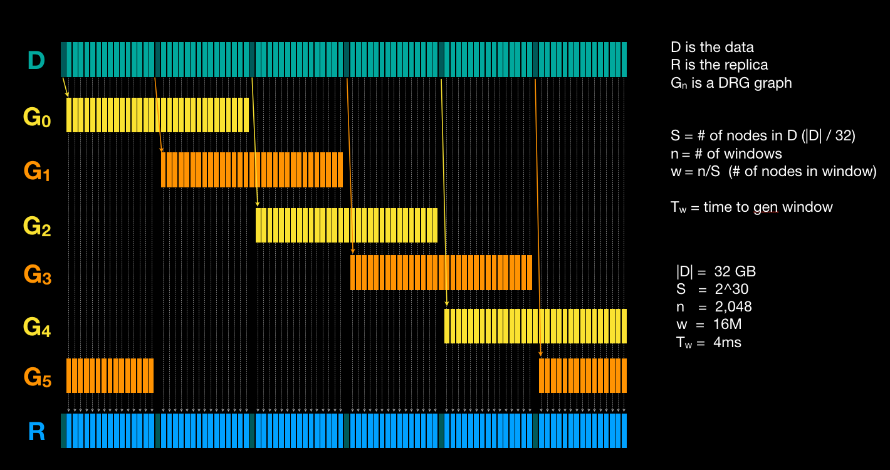

# WinPoRep Implementation

## Install

```
go install github.com/jbenet/winporep/winporep
```

## Usage

```sh
> winporep -h
SYNOPSIS
  ./winporep - implementation of WinPoRep

OPTIONS
  -h, --help          show this help message
  -v                  show debugging output
  --seed <string>     set a seed for the porep
  --winsize <int>     set the window size parameter
  --parents <int>     set the DRG parents parameter
  --stagger <int>     set the DRG stagger parameter

EXAMPLES
  # encode it
  winporep largefile largefile.rep

  # decode it
  winporep largefile.rep largefile2

  WARNING: hacky and untested. may eat your files.
```


